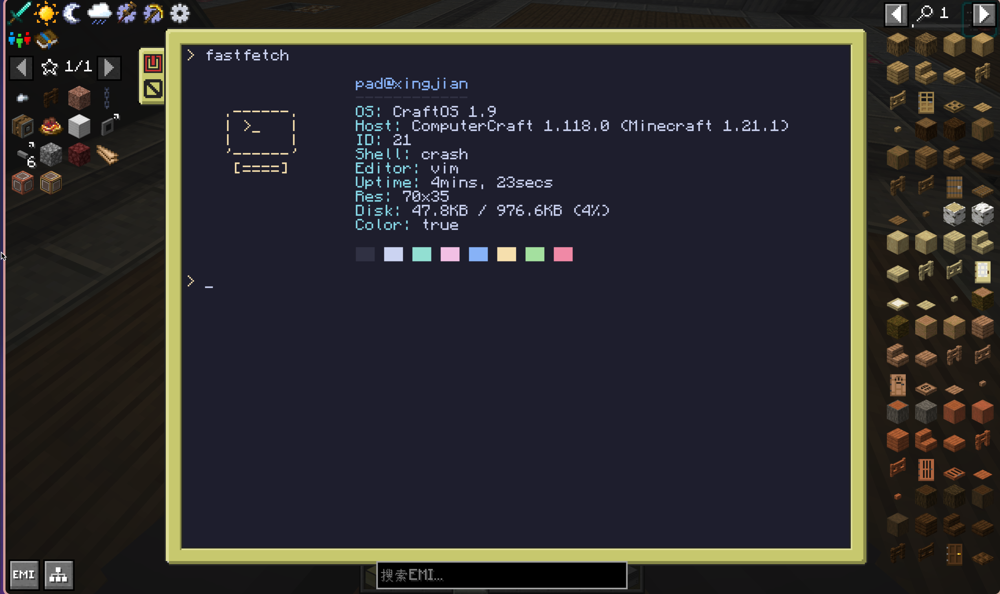
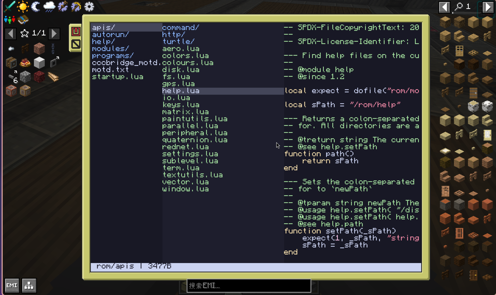
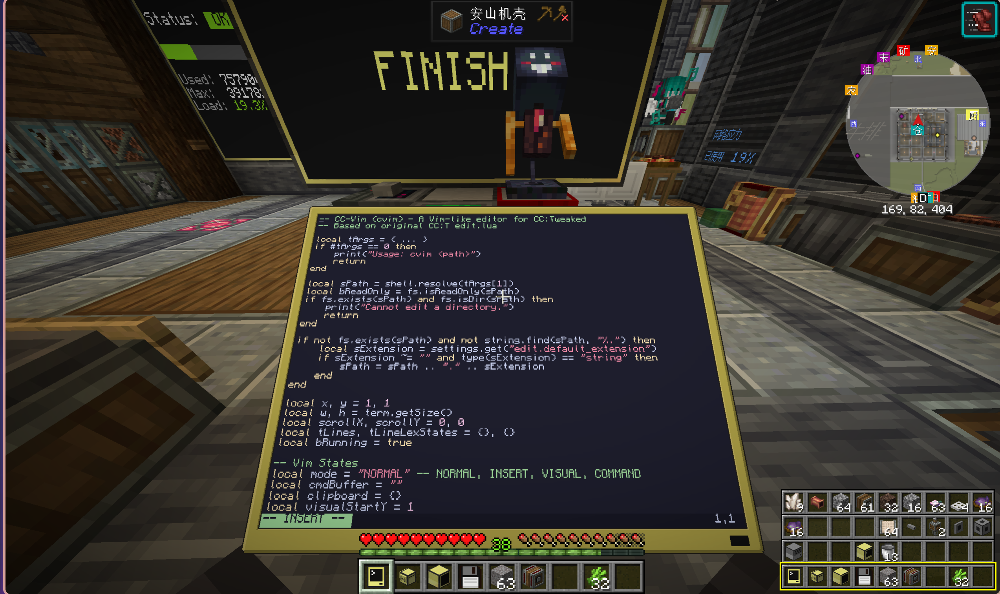

# CC-linux-like

<div style="display: grid; grid-template-columns: repeat(2, 1fr); gap: 10px; width: 80%; margin: 0 auto;">
    
    
    
</div>

For some linux nerds who just wanna use neofetch and vim everywhere like me XD. The repo provided these programs for them:

- vim
- cat(more close to less)
- touch
- yazi
- grep
- pwd
- tree
- neofetch
- git
- ...

```bash
wget run https://raw.githubusercontent.com/timetetng/CC-linux-like/main/install.lua
```

Enjoy your CraftOS.
